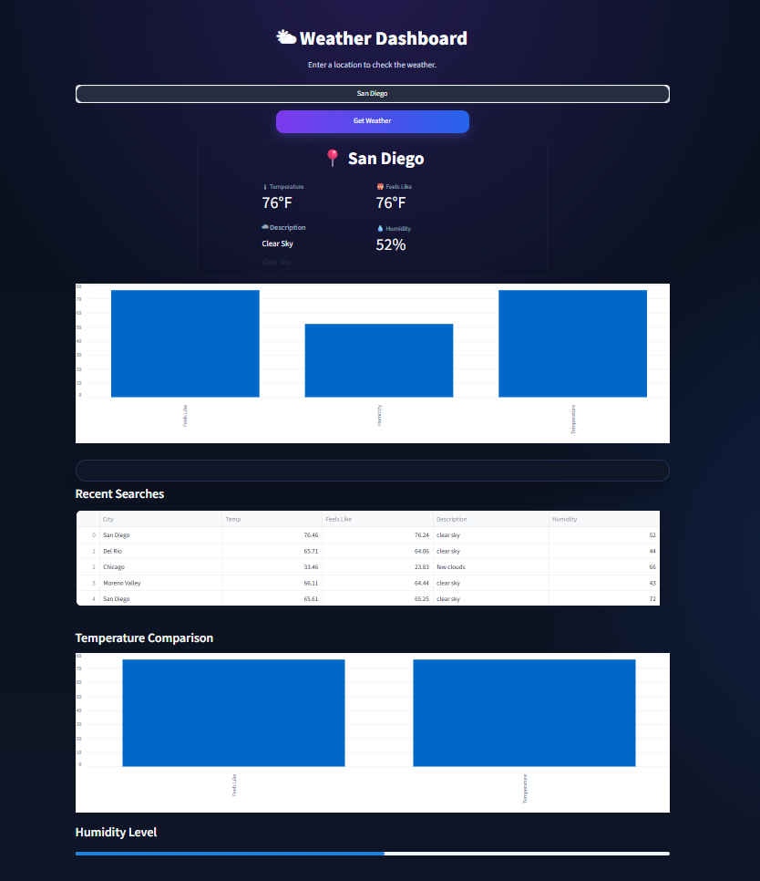

# Weather Dashboard

A live interactive weather dashboard built in Python that fetches real-time weather data for any city in the world, stores search history in a local database, and displays it through a clean web interface.

---

## Dashboard Preview



---

## What It Does

- Type any city name and instantly get live weather data
- Displays temperature, feels like, humidity, and weather description
- Saves every search to a local database so you can track history
- Shows your 5 most recent searches in a table
- Visualises temperature and humidity with bar charts

---

## Tools & Libraries Used

| Tool | Purpose |
|---|---|
| Python | Core programming language |
| Streamlit | Builds the interactive web interface |
| Geopy | Converts city names to coordinates |
| OpenWeatherMap API | Fetches live weather data |
| SQLite | Stores search history locally |
| Pandas | Formats data for display |
| python-dotenv | Keeps the API key secure |

---

## Project Structure

```
WeatherDashboard/
├── main.py              ← Streamlit UI and dashboard layout
├── info.py              ← Database logic (save and retrieve weather)
├── geoLogic.py          ← Converts location to coordinates and fetches weather
├── app.py               ← Quick location test script
├── runFromCmdLine.py    ← Launches the app from the command line
├── weather.db           ← SQLite database storing search history
├── dashboard_preview.png← App screenshot
├── .env                 ← API key (never uploaded to GitHub)
├── .gitignore           ← Tells GitHub to ignore .env
└── README.md
```

---

## How It Works

```
User types a city name
        ↓
Geopy converts it to coordinates (latitude & longitude)
        ↓
OpenWeatherMap API fetches live weather for those coordinates
        ↓
SQLite saves the result to the local database
        ↓
Streamlit displays the weather and the recent search history
```

---

## Setup & Installation

**Step 1 — Clone the repository:**
```
git clone https://github.com/ChaseBrangham/WeatherDashboard.git
cd WeatherDashboard
```

**Step 2 — Install dependencies:**
```
pip install streamlit geopy requests pandas python-dotenv
```

**Step 3 — Create your `.env` file:**
```
API_KEY=your_openweathermap_api_key_here
```
Get a free API key at [openweathermap.org](https://openweathermap.org/api)

**Step 4 — Run the app:**
```
streamlit run main.py
```

Or run `runFromCmdLine.py` directly in PyCharm.

---

## Key Features

- **Live data** — pulls real-time weather from OpenWeatherMap every search
- **Search history** — SQLite database stores every city you search
- **Secure** — API key stored in `.env` file, never exposed in code
- **Modular code** — logic split across separate files for clean structure

---

## Author

**Chase Brangham**
[GitHub Profile](https://github.com/ChaseBrangham)
